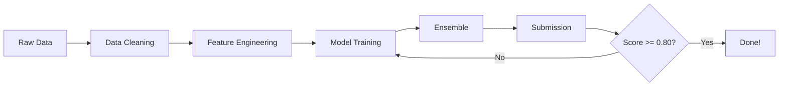

# 📋 Team Task Assignments — Titanic ML Project

> **Project:** Titanic - Machine Learning from Disaster  
> **Target:** Kaggle Public Leaderboard Accuracy > 0.80

---

## Task Overview

| # | Task | Owner | Status | Priority |
|---|------|-------|--------|----------|
| 1 | Data Cleaning | 🔲 Unassigned | ⏳ Pending | 🔴 High |
| 2 | Feature Engineering | 🔲 Unassigned | ⏳ Pending | 🔴 High |
| 3 | Model Tuning | 🔲 Unassigned | ⏳ Pending | 🔴 High |
| 4 | Ensemble Methods | 🔲 Unassigned | ⏳ Pending | 🟡 Medium |
| 5 | Submission & Validation | 🔲 Unassigned | ⏳ Pending | 🔴 High |

---

## Task 1: Data Cleaning

**Goal:** Ensure data quality before feature engineering.

### Sub-tasks:
- [ ] Load `train.csv` and `test.csv`, inspect shapes & dtypes
- [ ] Identify missing values: Age (~20%), Cabin (~77%), Embarked (~0.2%), Fare (~0.07%)
- [ ] Implement age imputation by group median (Title × Sex × Pclass)
- [ ] Fill Embarked with mode ("S")
- [ ] Fill Fare with median
- [ ] Extract deck letter from Cabin; treat empty as "M" (Missing)
- [ ] Detect and handle outliers in Age/Fare
- [ ] Validate no NaN values remain after preprocessing
- [ ] Document cleaning decisions in notebook

### Deliverables:
- Cleaned train/test DataFrames
- Missing value report (before/after)

### Files to modify:
- `src/preprocessor.py`
- `notebooks/01_eda_and_feature_engineering.ipynb`

---

## Task 2: Feature Engineering

**Goal:** Create predictive features that improve model performance.

### Sub-tasks:
- [ ] Extract Title from Name → normalize to {Mr, Mrs, Miss, Master, Royalty, Officer, Dr, Rev}
- [ ] Create FamilySize = SibSp + Parch + 1
- [ ] Create IsAlone binary flag (FamilySize == 1)
- [ ] Create FareBin (5 quantile bins: VeryLow / Low / Medium / High / VeryHigh)
- [ ] Create AgeBand (5 bins: Child / Teen / Adult / MiddleAge / Senior)
- [ ] Create Deck letter from Cabin
- [ ] Create interaction features (optional): Sex×Pclass, Title×Pclass, Age×Pclass
- [ ] Encode categorical features (Sex, Embarked, Title, Deck) via one-hot or label encoding
- [ ] Scale numeric features (StandardScaler)
- [ ] Document feature importance analysis

### Deliverables:
- Engineered feature set with clear naming convention
- Feature correlation heatmap
- Survival rate by each new feature (bar charts)

### Files to modify:
- `src/feature_engineering.py`
- `src/preprocessor.py`
- `notebooks/01_eda_and_feature_engineering.ipynb`

---

## Task 3: Model Tuning

**Goal:** Train and optimize multiple classifiers.

### Sub-tasks:
- [ ] Implement Logistic Regression baseline
- [ ] Implement Random Forest with GridSearchCV
- [ ] Implement XGBoost (if installed) with hyperparameter grid
- [ ] Implement LightGBM (if installed) with hyperparameter grid
- [ ] Implement SVM (RBF kernel) with C/gamma tuning
- [ ] Implement MLP (2-layer neural network) with tuning
- [ ] Run Stratified K-Fold CV (n_splits=5) for all models
- [ ] Log metrics: accuracy, precision, recall, F1, ROC-AUC
- [ ] Compare results in summary table
- [ ] Plot ROC curves for all models (one figure)
- [ ] Plot confusion matrix for best model
- [ ] Plot feature importance for tree-based models
- [ ] Select top 3 models for ensemble

### Deliverables:
- Model comparison table (CSV/markdown)
- Best model saved as `outputs/model.pkl`
- Hyperparameter logs

### Files to modify:
- `src/models.py`
- `src/train.py`
- `configs/config.yaml`
- `notebooks/02_modeling_and_submission.ipynb`

---

## Task 4: Ensemble Methods

**Goal:** Combine multiple models for improved accuracy.

### Sub-tasks:
- [ ] Implement VotingClassifier (soft voting) with top 3 models
- [ ] Implement StackingClassifier (meta-learner: LogisticRegression)
- [ ] Tune ensemble weights if using weighted voting
- [ ] Cross-validate ensemble vs individual models
- [ ] Check for overfitting (train vs CV score gap)

### Deliverables:
- Ensemble model object
- Comparison: ensemble vs best single model

### Files to modify:
- `src/train.py`
- `notebooks/02_modeling_and_submission.ipynb`

---

## Task 5: Submission & Validation

**Goal:** Generate valid Kaggle submission file.

### Sub-tasks:
- [ ] Load trained best model (or ensemble)
- [ ] Generate predictions on test set
- [ ] Create submission.csv format: PassengerId, Survived (int)
- [ ] Validate submission format matches sample
- [ ] Save to `outputs/submission.csv`
- [ ] Sanity check: survival rate ~38% (matches training distribution)
- [ ] Upload to Kaggle and record public leaderboard score
- [ ] If score < 0.80: iterate on features/models

### Deliverables:
- `outputs/submission.csv`
- Leaderboard screenshot/score

### Files to modify:
- `src/predict.py`
- `notebooks/02_modeling_and_submission.ipynb`

---

## Workflow Notes



### CLI Commands:
```bash
# Full pipeline
python src/train.py --config configs/config.yaml
python src/predict.py --config configs/config.yaml

# Notebook workflow
jupyter notebooks/
```

---

## Progress Tracking

Update this file as tasks are completed:

| Date | Task | Status | Notes |
|------|------|--------|-------|
| — | Project setup | ✅ | Repo created, structure defined |
| — | Data Cleaning | ⏳ | — |
| — | Feature Engineering | ⏳ | — |
| — | Model Tuning | ⏳ | — |
| — | Ensemble | ⏳ | — |
| — | Submission | ⏳ | — |

---

*Last updated: Project initialization*
