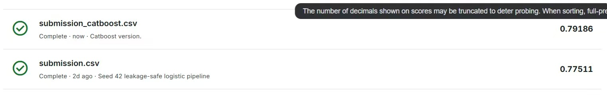

# Titanic CatBoost：精确家庭与票号特征

这是一个可公开上传到 GitHub 的最小 CatBoost 复现项目。模型从 Kaggle
Titanic 原始 `train.csv` 开始训练，所有年龄、票价、家庭和票号统计都只在
训练数据上拟合，然后生成官方测试集提交文件。

## 成绩

| 版本 | Kaggle 显示的 Public Score |
|---|---:|
| 旧 Logistic Regression 基线 | 0.77511 |
| 本 CatBoost 版本 | **0.79186** |

显示分数提高 `0.01675`，约 1.68 个百分点。Kaggle 可能截断界面中显示的
小数，而且隐藏测试集真值未知，因此该分数不构成最终排名保证。



## 唯一冻结提交

应上传到 Kaggle 的文件：

```text
data/submission_catboost.csv
```

冻结契约：

```text
Rows:                418
PassengerId:         892–1309
Predicted survivors: 143
SHA-256:             a1430b27beb42c1df95ddc99f73f901cb16481d663940518b1b56bda6272b4cd
```

这不是旧 LR 的 `submission.csv`，也不是四模型 Blend 提交。

## 方法

折内特征工程包括：

- 精确票号、票号人数、人均票价
- 姓氏、家庭键和家庭人数
- 称谓、家庭规模、独行标记
- 母亲、儿童和成年男性标记
- Cabin deck、票号前缀、年龄/票价区间
- 年龄和票价缺失标记及训练集内填补

最终 CatBoost 参数和源数据哈希记录在 `manifest.json`。最终随机种子为
`90045`，决策阈值固定为 `0.50`。

离线结果：

| 验证口径 | Accuracy |
|---|---:|
| 普通 5 折外层 OOF（来自 5×4 融合流水线，CatBoost 参数固定） | 0.8440 |
| 家庭/票号隔离的 5 折外层 OOF（CatBoost 参数固定） | 0.8114 |

普通分层验证更接近传统 Titanic 建模方式；严格分组验证用于衡量面对全新
家庭和票号时的稳健性。二者都不是 Kaggle 隐藏测试集得分。这两个聚合指标
来自完整的内部模型比较流水线；本最小公开项目只负责精确复现最终 CatBoost
训练和提交，`reports/model_comparison.csv` 保留其汇总记录，不包含逐行 OOF 标签。

## 文件结构

```text
.
├── README.md
├── LICENSE
├── .gitignore
├── .gitattributes
├── requirements.txt
├── manifest.json
├── titanic_catboost.py
├── make_submission.py
├── verify_package.py
├── SHA256SUMS
├── data/
│   ├── submission_catboost.csv
│   └── raw/
│       └── README.md
├── outputs/
│   └── .gitkeep
├── reports/
│   ├── catboost_result.json
│   └── model_comparison.csv
├── docs/
│   └── kaggle_public_score.jpg
└── tests/
    └── test_contract.py
```

Kaggle 原始数据没有放进公开包；用户需自行下载。

## 从零运行

推荐 Python 3.13：

```bash
python3.13 -m venv .venv
source .venv/bin/activate
python -m pip install --upgrade pip
python -m pip install -r requirements.txt
```

从 Titanic 竞赛页面下载 `train.csv`、`test.csv` 后放入：

```text
data/raw/train.csv
data/raw/test.csv
```

生成提交：

```bash
python make_submission.py
```

输出：

```text
outputs/submission_catboost.csv
outputs/catboost_run_summary.json
```

正确环境和官方原始数据应生成与冻结提交完全相同的 418 行预测。程序默认核对
官方原始文件的 SHA-256；若文件被改过，会在训练前停止并说明原因。

## 测试与校验

不放原始数据时，运行静态提交契约测试：

```bash
python -m unittest -v tests/test_contract.py
python verify_package.py --strict-public
```

如果 `data/raw/train.csv` 和 `data/raw/test.csv` 存在，测试还会真正重新训练
CatBoost，并要求输出逐行等于冻结提交。此时直接运行下面的命令，校验器会自动
识别这两个本地文件并执行完整验证：

```bash
python verify_package.py
```

`data/raw/*.csv` 已被 `.gitignore` 排除；上传 GitHub 前仍应移走它们，并再次
运行 `python verify_package.py --strict-public`。

核对哈希：

```bash
shasum -a 256 -c SHA256SUMS
```

## 公开仓库说明

本仓库故意不包含：

- Kaggle 原始 train/test 数据
- 包含真实 `Survived` 标签的逐行 OOF 文件
- 四模型 Joblib bundle
- LR、XGBoost、ExtraTrees 或重复 Blend 提交
- `.venv`、缓存、Token、`kaggle.json` 和个人绝对路径

代码采用 MIT License。Kaggle 数据仍受其原始竞赛条款约束。
